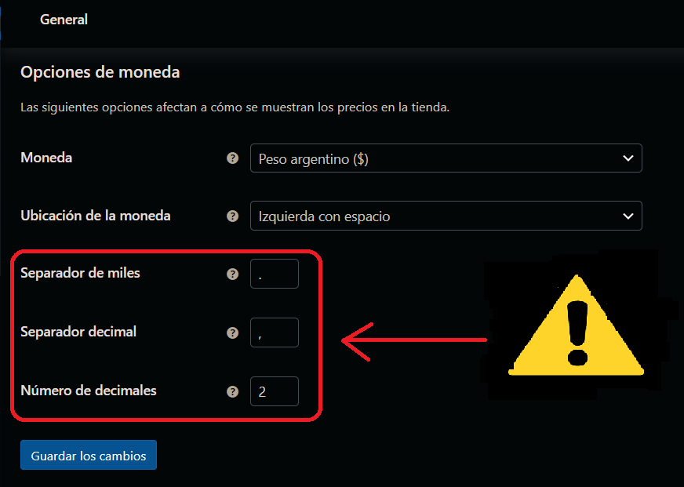
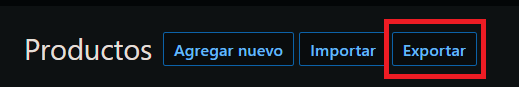

# Payway Payment Gateway for WordPress
Plugin de integracion con Payway para WooCommerce.

## Importante
> **No utilizar directamente en un entorno Productivo**.
>
> En cambio, utilizar un entorno de desarrollo/integracion/UAT, y realizar las pruebas necesarias confirmando el correcto funcionamiento del plugin y su comportamiento con las personalizaciones y Theme que tiene en su sitio.

Todas las instalaciones de WordPress varian en sus caracteristicas, dependiendo de los plugins, tema activo (theme), personalizaciones, cache, etc que tengan implementadas. Es por ello que se recomienda enfaticamente realizar pruebas en un entorno previo (siendo este una copia fiel de su actual sitio), para confirmar que ninguno de las caracteristicas mencionadas afecten el comportamiento de este plugin.

## Requisitos
* Wordpress `>= 5.8.3 <= 6.1.3`
* WooCommerce `>= 6.0 <= 8.4.0`
* PHP `>=7.4 <= 8.*`
* MySQL `>= 5.7` || MariaDb `>= 10.2 <= 10.4`

## Instalación
Para la instalación puede optar por subir el plugin a traves del Administrador. O bien, copiar el plugin manualmente dentro de la instalación de WordPress.
Recuerde: no es necesario realizarlo de las dos formas, escoja la forma que le sea mas conveniente.

### Via Administrador
1. Ingrese al panel de Administración de WordPress
2. Ingrese a la sección _Plugins > Agregar nuevo_
3. Haga click en el botón _Subir plugin_, que se encuentra a la derecha del titulo de la pagina.
4. En la sección que se despliega, haga click en el botón _Seleccionar..._ y, desde el cuadro de dialogo, seleccione el archivo `.zip` del plugin.
5. Haga click en el boton _Instalar ahora_
6. Cuando haya finalizado, dirijase a la sección _Plugins > Plugins instalados_ y haga click en el link _Activar_ que se encuentra debajo del nombre del plugin: _Payway Payment Gateway for WooCommerce_.

### Copia Manual
1. Descomprimir el archivo wc-gateway-payway.zip
2. Copiar carpeta `wc-gateway-payway` al directorio de plugins de su instalación de WordPress: `wp-content/plugins/`
3. Ingrese al panel de Administración de WordPress
4. Dirijase a la sección _Plugins > Plugins instalados_ y haga click en el link _Activar_ que se encuentra debajo del nombre del plugin: _Payway Payment Gateway for WooCommerce_.
5. Siempre que se agrega un plugin manualmente, es recomendable activar el modo debug para auditar si el plugin en cuestión está corriendo su ejecución satisfactoriamente.

## Configuración
### Credenciales y Datos del Comercio

1. Ingresar al menu de configuración del plugin desde: _WooCommerce -> Ajustes -> Pagos_
2. Activar el plugin _Medio de Pago Payway_ usando el boton ubicado en la columna **Activado**, dentro de la tab la con los metodos de pago.
3. Presionar el botón **Gestionar**, (en caso que, al habilitar el metodo de pago, no se redirija automaticamente a la sección de configuración)
4. Ingresar los datos solicitados en la pantalla

| Campo | Descripcion |
|------|------|
| Status| Habilitar o deshabilitar el medio de pago |
| Titulo| Titulo que se visualizara en el Checkout |
| Descripcion| Descripción a presentar en el Checkout |
| Modo Sandbox| Si el medio de pago debe funcionar en modo test, para pruebas |
| Usar Cybersource| Si se debe utilizar Cybersource para validar la información del Comprador |
| Modo Debug| Si el plugin debe generar logs con información para desarrolladores (ver la sección _Estado_ del plugin, para visualizar los logs)|
| Sandbox Site Id| Id del sitio para modo Sandbox |
| Sandbox Public Key| Clave publica para el modo Sandbox |
| Sandbox Private Key| Clave privada para el modo Sandbox |
| Production Site Id| Id del sitio para modo Productivo |
| Production Public Key| Clave publica para el modo Productivo |
| Production Private Key| Clave privada para el modo Productivo |

## Consideraciones
El formulario no será presentado en el Checkout, si:
- El plugin está deshabilitado en la configuración de WooCommerce (ver WC config: WooCommerce > Ajustes > Pagos > Medio de Pago Payway: Activado - Si)
- WooCommerce está configurado en otra moneda diferente a _Peso Argentino ($)_ (ver WC config: WooCommerce > Ajustes > General > Opciones de Moneda > Moneda)
- El plugin Payway no contiene una Promoción configurada correctamente (ver sección: Promociones > Consideraciones en este README)

 

 **Cuando se trata de ajustar las "Opciones de moneda"...**
En el plugin de WooCommerce, debes seguir la siguiente ruta: Woocommerce -> Ajustes -> General -> "Opciones de moneda" -> "Número de decimales".

**En esta configuración, solo hay una opción válida:**
- Colocar el valor **[2]**, para poder operar con decimales.

Si seleccionas cualquier otro valor, podrían surgir errores, ya que el plugin fue diseñado teniendo en cuenta la representación de la moneda actual en el mercado.

Es recomendable hacer un **backup** de los productos que tenemos cargados, para **tener un respaldo de los precios.**

## Menú lateral
En el menú lateral de su Backoffice, se habilitará el grupo "Payway", donde podrá configurar tarjetas de crédito/débito, bancos y promociones con sus respectivos planes.

### Bancos
En el menú _Payway > Bancos_, podrá administrar los bancos o emisores de tarjetas con los que necesite operar.

**Agregar Banco**
- En la esquina superior derecha de la tabla de bancos presione en el botón add new/agregar nuevo.
- Ingrese los datos requeridos en el formulario que se desplegará.
- Puede cargar una imagen desde su computadora, y activar o desactivar el banco.
- Presione guardar para aplicar los cambios.
​

**Editar Banco**
- En la tabla de bancos, sobre la fila correspondiente, presione el botón _Editar_.
- Se desplegará el mismo formulario del ítem anterior. Aquí puede modificar los datos a su gusto.

​
**Eliminar Banco**
- En la tabla de bancos, sobre la fila correspondiente, presione el botón "Eliminar".
- Se le pedirá confirmar la eliminación del banco.
​

### Tarjetas
En el menú _Payway > Tarjetas_, podrá administrar los tipos de tarjetas con las que necesite operar.
​

**_Agregar_ Tarjeta**
- En la esquina superior derecha de la tabla de tarjetas presione en el botón _Agregar_.
- Ingrese los datos requeridos en el formulario que se desplegará.
- Presione guardar para aplicar los cambios.
​

**Editar Tarjeta**
- En el listado de Tarjetas, sobre la fila correspondiente, presione el botón _Editar_.
- Se desplegará el mismo formulario del ítem anterior. Aquí puede modificar los datos a su gusto.
​

**Eliminar Tarjeta**
- En la tabla de tarjetas, sobre la fila correspondiente, presione el botón "Eliminar".
- Se le pedirá confirmar la eliminación de la tarjeta.​
​

### Promociones
En el menú _Payway > Promociones_, podrá administrar las promociones y condiciones de cuotas sobre los pedidos realizados. Defina los planes de cuotas en esta sección según sea necesario.
​

**Agregar Promoción**
- Haga click en el link _Agregar nuevo Plan_.
- Ingrese los datos requeridos en el formulario que se desplegará.
- Deberá seleccionar las tarjetas y bancos a los que alcanzará la promoción.
- Deberá seleccionar en qué días de la semana esta promoción estará disponible y desde y hasta qué fechas.
- Si su PrestaShop maneja multitienda, deberá seleccionar sobre cuál de ellas ésta promoción será aplicada.
- Elija una posición para darle mayor prioridad a esta promoción.
- Puede activar o desactivar la promoción.
​

**Editar Promoción**
- En la tabla de promociones, sobre la fila correspondiente, presione el botón "Editar".
- Se desplegará el mismo formulario del ítem anterior. Aquí puede modificar los datos a su gusto.
​

**Eliminar Promoción**
- En la tabla de promociones, sobre la fila correspondiente, presione el botón "Eliminar".
- Se le pedirá confirmar la eliminación de la promoción.
​

#### Configuración de Planes para una Promoción
En el mismo formulario de edición y creación de una Promoción, tendrá disponible una tabla de Planes e Intereses. Estas serán las cuotas a mostrar al comprador.
​

#### Valores de un Plan
| Campo  | Valor  | Descripcion  |
|---|---|---|
| Periodo | numero entero | El numero de Cuota de la Promoción |
| Coeficiente  | entero o decimal con punto | El interes a ser aplicado a la cuota del Plan |
| TEA | decimal con punto | Por default debe colocar `0`   |
| CFT | decimal con punto | Por default debe colocar `0`   |
| Valor a Enviar | numero entero | El número de cuota de la Promoción a enviar al medio de pago.   Usualmente este valor es exactamente el mismo que _Periodo_. Pero, pudiera existir la necesidad de mostrar un numero de cuota en el Checkout (_Periodo_) y enviar un valor diferente al gateway de pago (_Valor a Enviar_). Si tiene dudas, coloque el mismo valor que el campo _Periodo_. |

**Ejemplo de Plan y sus valores**

Plan a Configurar:
* 1 cuota sin interés
* 3 cuotas sin interés
* 6 cuotas con 20% de interés (equivale a 1.20 que se indica en el campo Coeficiente), mostrar en el Checkout el valor `6` en el desplegable de Cuotas y enviar al medio de pago, el valor de cuota `6`.

| Periodo | Coeficiente | TEA | CFT | Valor a Enviar |
|---|---|---|---|---|
| 1 | 1 | 0 | 0 | 1 |
| 3 | 1 | 0 | 0 | 3 |
| 6 | 1.20 | 0 | 0 | 6 |

**Agregar Plan**
- Click en _Agregar un nuevo Plan_ una nueva fila a la tabla con los campos que deberá completar según lo necesite.
- El campo "Periodo" indica el número de cuotas que se asignarán al pago.
- El campo "Coeficiente" indica el interés correspondiente al número de cuota.
- Los campos "TEA" y "CFT" son indicativos, y no son requeridos.
- El campo "Valor a enviar" se utiliza para indicar el número de cuotas que se enviarán al gateway. Este campo debe tener el mismo valor que el campo "Cuota", a excepción de casos especiales, como al utilizar el emisor de tarjeta "Ahora 12".
​

**Editar Plan**
- En la tabla de promociones, sobre la fila correspondiente, modifique los campos que necesite y presione el botón guardar en la parte inferior del formulario.
​

**Eliminar Plan**
- En la ultima columna de la tabla, sobre la fila correspondiente, presione el link _Eliminar_.
- Luego, haga click en _Guardar_ para persistir los cambios.

#### Consideraciones
Si una Promoción tiene alguna de estas caracteristicas, no se visualizara en el formulario del Checkout:
- Fecha y Hora en los campos _Desde_ y _Hasta_, inexistentes o invalidas
- No posee al menos un Plan
- No posee al menos un dia aplicable
- La Promoción tiene el valor `Deshabilitado` en el campo _Habilitado_

## Technical Notes

### Accounting Library
Checkout Form makes use of `accounting` JS library (already included in WooCommerce) to display the prices in the same way your Store is configured. If you have customized your theme to strip out this lib, form won't work.

# Changelog
## 0.3.1
### improvements
- **added door number to payway checkout**; added to pass vte validations

## 0.2.4
### bugfix
- **unable to access billing address on guest**; fixes CS trying to extract the `street1` value from a Guest Checkout
- **`establishment_name` length**; fixes so blog name string matches expected max length
- **`security_code` field**; add security_code field during token creation process

## 0.2.3
### improvements
- **error logs**; improve how some exceptions during place order are displayed

## 0.2.2
### bugfix
- **Credentials**; fix when retrieves production keys, now processes all required configurations for Connector class creation.

## 0.2.1
### bugfix
- **Promotions Admin**; fix how errors are displayed during CRUD operations

## 0.2.0
### improvements
- **Uninstall Hook added**; process will drop custom tables and clean all configuration options previously saved in `wp_options` table. It won't delete existing transaction data already saved within Orders.

- **Checkout form validations**; implements custom validations into checkout form to avoid wrong data being posted to the gateway.

- **`site_transaction_id` value**; now it's built by the WC_Order id and a timestamp value. Avoids *repeated site_transaction_id* error for OmniChannel Merchants using the same `merchant_id` in all the integrations.

### bugfix
- **Localization**; implement missing translations for CRUD admin panel operations in `es_AR`.

- **Order Total now includes fees**; previously if Customer selected an installment with an insterest applied through the coefficient field in Promotions backoffice section, the total sent to the gateway was the one in the Order, instead of the total including the fee.

- **Available Promotions in Checkout**; now takes into account the Applicable Days configured.

## 0.1.0
- Initial version
